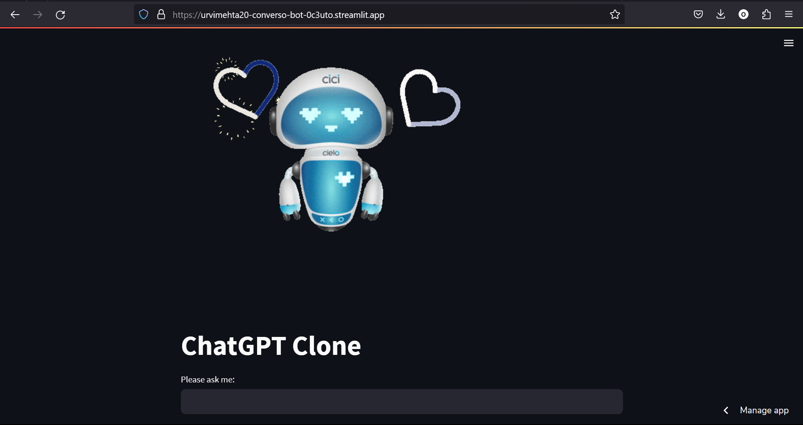

# Converso - A ChatGPT Clone

Converso is a ChatGPT clone developed to provide an engaging and interactive conversational AI experience. The project utilizes the OpenAI API to implement various NLP features, ensuring seamless and meaningful interactions with users.

It is a ChatGPT clone utilizing the OpenAI API, natural language processing, API integration, and chatbot development. 

